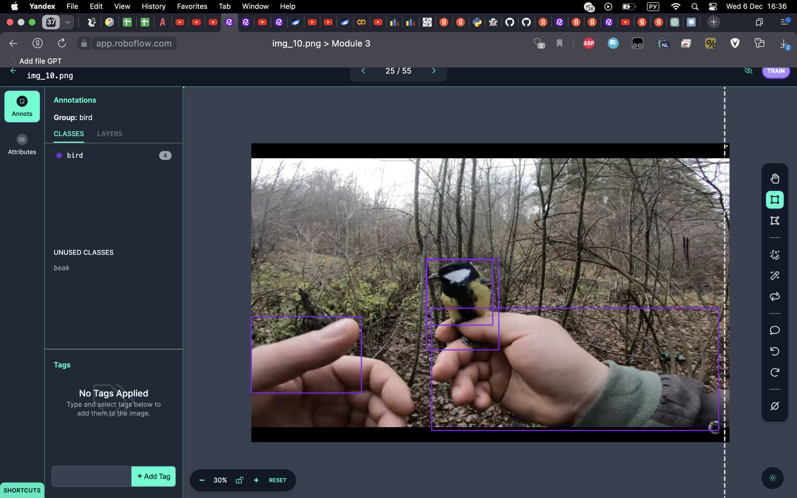
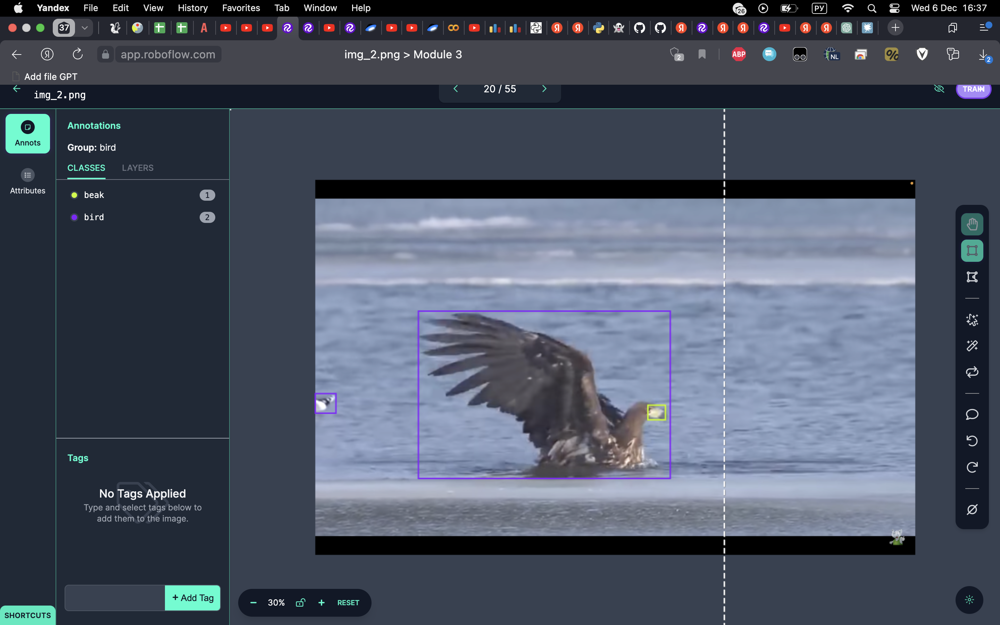

# DataEngineering-Course
A repository for homeworks on Data Mining &amp; Labeling course in AI Talent Hub ITMO

Курс по сбору и разметке данных

# 1 Module
- Взял открытый датасет RTS со знаками дорожного движения
- Написал парсер для скрапинга фотографий с сайта, которые пойдут в добавление к основному датасету. Код с парсером в 'web_scraping.py'. Спарсенные фотографии лежат в папке 'Web_Scraping_img'
- Проанализировал датасет RTS. Провел его EDA.

# 2 Module
Необходимо было разметить данные, которые были спарсены в предыдущем модуле.
- Написал инструкцию для разметчиков. Разметка проводилась на сайте VGG Image Annotator ('https://annotate.officialstatistics.org/'). 
- Два человека участвовали в разметке данных. Я получил от них 2 JSON файла, а также некоторые исправления в итоговую инструкцию для разметчиков.
- Проанализировал эти файлы с аннотациями. Сделал выводы и составил итоговую аннотацию к размеченным данным.

# 3 Module
Реализовано активное обучение YOLOv8n.
Цель: детекция птиц и их клювов.
- В начале был скачан датасет из [туториала по обучению YOLO](https://www.youtube.com/watch?v=GGmnkEsgf50&t=2986s).
- YOLOv8n обучена на двух эпохах на датасете `my_dataset_yolo`, имеет следующие параметры:

| Model  | precision | recall  | mAP50 | mAP50-95 |
| ------------- | ------------- | ------------- | ------------- | ------------- |
| `YOLOv8n` | 0.81602  | 0.7168  | 0.74829  | 0.49419  |

- Из другого видео были взяты 10 скриншотов. Находятся в папке `new_image`. Данные фотографии прогнались через модель и получили автоматическую разметку от модели, потом координаты bbox's доставались и определялись в переменные. Код данного процесса лежит в `Auto_annotation.ipynb`.
- Далее размеченные фотографии выгружаются в свой проект на [roboflow](https://roboflow.com/). Сеть умеет размечать птиц, но всё равно ошибается. Также сеть не нашла ни одного клюва птицы и не разметила одну фотографию с птицей. В принципе неплохой результат. Исправляем некоторые ошибки в разметке и пробуем дообучить сеть на этих данных (`my_dataset_yolo_v2`).

| Model  | precision | recall  | mAP50 | mAP50-95 |
| ------------- | ------------- | ------------- | ------------- | ------------- |
| `YOLOv8n` | 0.82139  | 0.78778  | 0.81281  | 0.50082 |

- Как можно увидеть, метрики улучшаются, значит всё работает. Попробуем повторить весь процесс.
- Клюв сеть смогла определить только на одной из 25 фотографий. Также человеческие руки она посчитала за птиц. Но в общем и целом, если на снимке только птица и относительно нейтральный фон, то детекция птицы прекрасно осуществляется.

Сделал версионирование датасета после итераций активного обучения. Ознакомиться с ними можно по [ссылке](https://universe.roboflow.com/itmo-yoa5m/module-3/dataset/4).